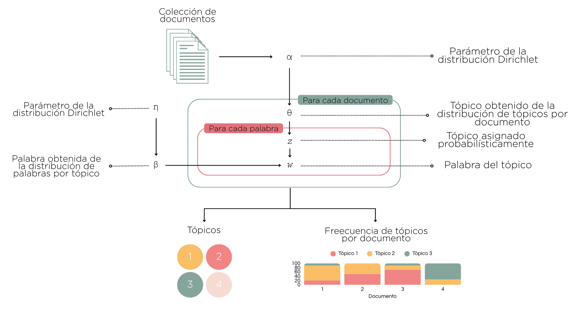

```{r results='hide', message=FALSE, echo=FALSE, warning=FALSE}
set.seed(1406)
library(showtext)
showtext_auto()
font_add_google(name="Noto Serif", family = "libre")
```

```{=tex}
\thispagestyle{empty}
\begin{center}
    \vspace*{0.5cm}
    \huge\textbf{Análisis de comentarios en redes sociales con latent Dirichlet allocation}
    
    \vspace{4cm}
    \includegraphics[width=0.3\textwidth]{logo_unr.png}
  
    \vspace{0cm}
    \large{Facultad de Ciencias Económicas y Estadística}
    
    \vspace{0cm}
    \large{Alumna: Alfonsina Badin}
    
    \vspace{0cm}
    \large{Director: Ignacio Evangelista}
    
    \vspace{0.5cm}
    \large{Rosario, 2025}
    
\end{center}
```
\clearpage

\pagenumbering{arabic}  
\setcounter{page}{1}    
\addcontentsline{toc}{section}{Índice}
\tableofcontents
\clearpage

\newpage

# Introducción

A lo largo de los años, las redes sociales se han convertido en el medio de comunicación más utilizado. Diariamente, los usuarios ingresan a ellas para conversar con otras personas, dar a conocer sus puntos de vista, compartir experiencias, informarse sobre las últimas noticias y entretenerse.

En los últimos años, hubo un formato audiovisual que se popularizó con gran velocidad: el *streaming*.  El *streaming* es una combinación de radio y televisión, que se transmite en vivo en una plataforma gratuita (YouTube o Twitch) y luego es publicado para su consumo *on-demand*, de modo que el usuario pueda verlo fuera de su horario habitual si así lo desea. Por lo general el formato consta de un panel de conductores que charlan de tópicos comunes para la audiencia, generando debates interesantes con los que los usuarios se pueden llegar a identificar. Dentro de cada canal de *streaming* se transmiten distintos programas que tienen un perfil particular y objetivos diferentes ya que su contenido puede variar en entretenimiento, humor, chimentos, noticias, etc. 

Al publicar los programas *on-demand*, los canales acceden a un recurso valioso que refleja la opinión de sus oyentes: los comentarios de YouTube. El análisis de estos textos pueden resultar en conclusiones interesantes para los canales ya que permiten un entendimiento de los sentimientos que tiene su comunidad con respecto a cada contenido.

Para llevar a cabo este análisis, el se propone utilizar **latent Dirichlet allocation (LDA)**, una técnica de aprendizaje automático no supervisado que clasifica automáticamente los textos en diferentes categorías o temas según las características del corpus. Esta metodología permite detectar patrones temáticos recurrentes en grandes volúmenes de datos textuales, como los comentarios de YouTube, y extraer información valiosa.

LDA se basa en un modelo probabilístico generativo y es especialmente útil para modelizar la distribución de temas latentes en colecciones de documentos textuales. Es un modelo bayesiano jerárquico de tres niveles, en el cual cada documento (en este caso, cada comentario) se representa como una mezcla de temas, y cada tema se define como una mezcla de palabras. En este sentido, LDA no solo agrupa comentarios en función de temas compartidos, sino que también asigna probabilidades a cada palabra dentro de cada tema, proporcionando una representación explícita y estructurada del contenido del corpus.

# Objetivos

## Objetivo general

El objetivo general de este proyecto es presentar los fundamentos de la técnica LDA, su forma de implementación y su aplicación a la hora de identificar tópicos o categorías.

## Objetivos específicos

- Comprender las bases del procesamiento de lenguaje natural (NLP por sus siglas en inglés) y las técnicas de representación computacional de texto.
- Mencionar los desafíos y limitaciones que conlleva el ajuste de LDA y propuestas que han surgido para contrarrestar dichos inconvenientes.
- Aplicar LDA en un conjunto de comentarios en español (argentino) en la red social YouTube para comprender las opiniones de los oyentes.

\newpage

# Metodología

Latent Dirichlet allocation (LDA) es un modelo probabilístico diseñado para el descubrimiento automático de temas en grandes colecciones de textos. Este enfoque fue introducido por Blei, Ng y Jordan (2003) y ha sido ampliamente adoptado en tareas de modelado temático en el campo del Procesamiento de Lenguaje Natural. LDA supone que cada documento de un corpus está compuesto por una mezcla de varios temas, y cada uno de estos temas se define por una distribución de probabilidad sobre un conjunto de palabras. El modelo generativo se formaliza como un proceso jerárquico de tres niveles: en primer lugar, para cada documento se elige una distribución de temas a partir de una distribución Dirichlet; posteriormente, para cada palabra se selecciona un tema de acuerdo con la distribución del documento; finalmente, la palabra se extrae de la distribución de términos correspondiente al tema elegido. 



Este proceso permite que un mismo documento contenga proporciones variables de múltiples temas, lo cual resulta adecuado para contextos en los que los textos no presentan una única orientación semántica predominante. Asimismo, la representación probabilística facilita la interpretación y la comparación de los patrones temáticos subyacentes en el conjunto de datos.

En la práctica, se considera el problema inverso: se busca inferir los temas latentes y sus distribuciones a partir de los textos observados. Esto requiere estimar tanto la asignación de tópicos por documento como la asignación de palabras por tópico.

La aplicación de LDA requiere, como paso previo, la construcción de un corpus de documentos que constituirá la base del análisis. Utilizando la API de YouTube brindada por el servicio de Google Cloud y con la herramienta App Scripts integrada en SpreadSheets (Google), se realizó una recolección de comentarios de los canales más vistos del país (LUZU TV, OLGA, Pinky SD, LA CASA STREAMING, Bondi Live, Carajo, BLENDER, Vorterix), desde el 1 de enero del 2023 al día 20 de diciembre del 2024. En total, se analizaron 8 canales de streaming, 2.554 videos y 139.421 comentarios, que constituyen la base documental sobre la cual se llevará adelante el modelado temático.

Posteriormente, se realizará una limpieza de palabras innecesarias (*stopwords*) y una corrección ortográfica de los términos empleando una variante de la distancia de Levenshtein, que fue propuesta por Damerau (1964), con el objeto de reducir el impacto de errores de tipeo y variantes ortográficas frecuentes en los comentarios informales.

Dado que las estimaciones de las distribuciones temáticas se basan en los conteos de palabras, se requiere de una matriz documento-término para emplear la técnica LDA. La construcción de esta matriz implica, en primer lugar, un proceso de tokenización, mediante el cual cada documento es segmentado en unidades mínimas denominadas *tokens*, que habitualmente corresponden a palabras individuales. Esta operación permite transformar cadenas de texto en estructuras cuantificables y susceptibles de procesamiento computacional.

Posteriormente, se realiza la vectorización, que consiste en representar el corpus como una matriz en la que cada fila corresponde a un documento y cada columna a un término del vocabulario, registrándose la frecuencia de aparición de cada término en cada documento. Existen diversas técnicas de vectorización, entre las que se destacan la bolsa de palabras (Bag of Words), que considera únicamente las frecuencias absolutas, y el esquema TF-IDF (Term Frequency - Inverse Document Frequency), que pondera cada término según su relevancia relativa en el corpus. Asimismo, pueden incorporarse estrategias de reducción de dimensionalidad o filtrado de términos poco frecuentes.

Dado que cada enfoque presenta ventajas y limitaciones particulares, se prevé realizar un análisis comparativo de distintas opciones de tokenización y vectorización, con el fin de seleccionar la metodología más adecuada a las características del corpus y a los objetivos del estudio.

Una vez definida la representación matricial del corpus, se procederá a la aplicación del modelo latent Dirichlet allocation para la identificación de tópicos latentes, lo cual requiere la especificación de tres hiperparámetros principales: el número de tópicos ($k$) y las concentraciones de las distribuciones Dirichlet que regulan, respectivamente, la dispersión de temas por documento ($\alpha$) y de términos por tema ($\eta$). La definición de estos parámetros reviste especial importancia, dado que influye directamente en la coherencia de los tópicos identificados. 

Con el objetivo de seleccionar una configuración que maximice la capacidad explicativa del modelo, se prevé realizar una exploración sistemática de diferentes combinaciones de valores de $k$, $\alpha$ y $\eta$, evaluando la calidad de los resultados. Asimismo, se contemplará la interpretación cualitativa de los tópicos extraídos, analizando su correspondencia con las temáticas presentes en los contenidos de los canales de streaming relevados.

Finalmente, se proyecta la generación de visualizaciones que permitan explorar de manera intuitiva la distribución de temas en los comentarios y la asociación de términos característicos a cada tópico, con el objeto de facilitar el análisis e interpretación de los hallazgos.

Entre las principales limitaciones que pueden incidir en la aplicación de la metodología propuesta, se identifican diversos aspectos inherentes a la naturaleza del corpus. En primer lugar, el lenguaje utilizado en los comentarios es predominantemente informal, lo que implica la presencia de expresiones coloquiales, abreviaturas y modismos que pueden dificultar la normalización y la interpretación automática del texto. Asimismo, es frecuente la existencia de errores ortográficos y gramaticales que, si bien se mitigarán mediante procedimientos de corrección y limpieza, pueden afectar la calidad final de la representación vectorial y el desempeño del modelo.

Por otra parte, debe considerarse que los comentarios se encuentran redactados en español con un marcado sesgo regional, correspondiente a variantes léxicas y sintácticas propias del uso argentino del idioma. Este rasgo puede limitar la generalización de los resultados a otros contextos hispanohablantes y exigir un análisis contextual cuidadoso en la interpretación de los tópicos identificados.

\newpage

# Cronograma de actividades

1. Lectura de bibliografía de referencia y revisión de material: Octubre 2024 – Febrero 2025.

2. Elaboración del marco teórico y metodológico de la tesina: Octubre 2024 – Junio 2025.

3. Diseño del estudio y definición de la estrategia de análisis computacional: Mayo – Junio 2025.

4. Realización del estudio y análisis de resultados: Julio – Septiembre 2025.

5. Redacción de resultados, conclusiones y discusión final: Septiembre – Noviembre 2025.

# Fecha tentativa de presentación

Noviembre/Diciembre 2025

\newpage

# Bibliografía

- Blei, D. M., Ng, A. Y., & Jordan, M. I. (2003). latent Dirichlet allocation. *Journal of Machine Learning Research*, 3(January), 993–1022.

- Vajjala, S., Majumder, B., Gupta, A., & Surana, H. (2020). *Practical Natural Language Processing: A Comprehensive Guide to Building Real-World NLP Systems*. O'Reilly Media.

- Moyotl-Hernández, E. (2016). Método de corrección ortográfica basado en la frecuencia de las letras. *Research in Computing Science*, 124, 145–156.

- El Economista. (2024). Streaming en Argentina: cuáles son los canales líderes y cómo monetizan sus contenidos.

- Unidad 2: Representación Vectorial de Texto. Apunte de la carrera Tecnicatura en Inteligencia Artificial, materia Procesamiento de Lenguaje Natural.

- Google Developers. (s.f.). YouTube Data API Overview.
