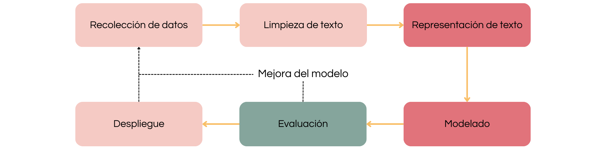

```{r results='hide', message=FALSE, echo=FALSE, warning=FALSE}
set.seed(1406)
library(showtext)
showtext_auto()
font_add_google(name="Noto Serif", family = "libre")
```

```{=tex}
\thispagestyle{empty}
\begin{center}
    \vspace*{0.5cm}
    \huge\textbf{Análisis de comentarios en redes sociales con latent Dirichlet allocation}
    
    \vspace{4cm}
    \includegraphics[width=0.3\textwidth]{logo_unr.png}
  
    \vspace{0cm}
    \large{Facultad de Ciencias Económicas y Estadística}
    
    \vspace{0cm}
    \large{Alumna: Alfonsina Badin}
    
    \vspace{0cm}
    \large{Director: Ignacio Evangelista}
    
    \vspace{0.5cm}
    \large{2025}
    
\end{center}
```

\clearpage
\pagenumbering{arabic}
\setcounter{page}{1}

\renewcommand{\contentsname}{Índice}

\setcounter{tocdepth}{4}
\tableofcontents

\clearpage

\newpage

# Agradecimientos

\newpage

# Resumen

\newpage

# Introducción {#sec-introduccion}

A lo largo de los años, las redes sociales se han convertido en el medio de comunicación más utilizado. Diariamente, los usuarios ingresan a ellas para conversar con otras personas, dar a conocer sus puntos de vista, compartir experiencias, informarse sobre las últimas noticias y entretenerse.

En el año 2020, a raíz de la pandemia mundial por COVID-19, hubo un tipo de contenido que se popularizó con gran velocidad: el *streaming*.  El *streaming* es una combinación de radio y televisión, que se transmite en vivo en una plataforma gratuita (YouTube o Twitch) y luego es publicado *On-Demand* para que el usuario pueda verlo fuera de su horario habitual si así lo desea. Por lo general el formato consta de un panel de conductores que charlan de tópicos comunes para la audiencia, generando debates interesantes con los que los usuarios se pueden llegar a identificar. Dentro de cada canal de *streaming* se transmiten distintos programas que tienen un perfil particular y objetivos diferentes ya que su contenido puede variar en entretenimiento, humor, chimentos, noticias, etc.  

Su popularidad se debe a que es un contenido gratuito, cercano y que genera una **comunidad** entre los conductores y sus oyentes, quienes no sólo interactúan en vivo a través de un *chat* sino que dejan sus comentarios en otras redes sociales: Instagram, TikTok, YouTube, entre otros.

Al publicar los programas *On-Demand*, los canales de *streaming* acceden a un recurso valioso que refleja la opinión de sus oyentes: los comentarios de YouTube. El análisis de estos textos puede resultar en conclusiones interesantes para los canales ya que permite un entendimiento de los sentimientos que tiene su comunidad con respecto a cada contenido.

Para llevar a cabo este análisis, el presente informe utiliza **latent Dirichlet allocation (LDA)**, una técnica de aprendizaje automático no supervisado que clasifica automáticamente los textos en diferentes categorías o temas según las características del corpus. Esta metodología permite detectar patrones temáticos recurrentes en grandes volúmenes de datos textuales, como los comentarios de YouTube, y extraer información valiosa.

LDA se basa en un modelo probabilístico generativo y es especialmente útil para modelar datos discretos como textos. Es un modelo bayesiano jerárquico de tres niveles, en el cual cada documento (en este caso, cada comentario) se representa como una mezcla de temas, y cada tema se define como una mezcla de palabras. En este sentido, LDA no solo agrupa comentarios en función de temas compartidos, sino que también asigna probabilidades a cada palabra dentro de cada tema, proporcionando una representación explícita y estructurada del contenido del corpus.

Esta capacidad de modelar documentos como combinaciones de múltiples temas lo hace particularmente adecuado para analizar la diversidad temática de los comentarios de YouTube. Por ejemplo, un comentario podría estar relacionado en un 60% con el tema "entretenimiento" y en un 40% con el tema "noticias", lo que permite identificar la interacción entre los intereses de los usuarios.

Esta tesina tiene por objeto de estudio la técnica latent Dirichlet allocation. Se brinda una introducción al tema, abarcando las definiciones básicas, sus componentes, sus variantes, sus ventajas y limitaciones y sus campos de aplicación. Se incluyen también los conceptos teóricos necesarios para comprender la metodología. Adicionalmente, se presenta la aplicación del modelo en comentarios de redes sociales.

\newpage

# Objetivos

## Objetivo general

El objetivo general del presente proyecto es profundizar en el estudio y aplicación del modelo latent Dirichlet allocation (LDA) para la identificación de tópicos o categorías.

## Objetivos específicos

- Comprender las bases del procesamiento de lenguaje natural (NLP por sus siglas en inglés) y las técnicas de representación computacional de texto.
- Mencionar los desafíos y limitaciones que conlleva el ajuste de LDA y propuestas que han surgido para contrarrestar dichos inconvenientes.
- Aplicar LDA en un conjunto comentarios en español (argentino) en la red social YouTube para comprender las opiniones de los oyentes.

\newpage

# Metodología

## Machine learning

### Aprendizaje supervisado

### Aprendizaje no supervisado

\newpage

## Procesamiento de Lenguaje Natural (NLP)

El texto, tal como lo leemos y comprendemos los humanos, es rico en significado pero carece de una estructura intrínsecamente numérica, que es la base del procesamiento en los algoritmos de aprendizaje automático. El procesamiento de lenguaje natural es un área de investigación dentro de la informática y la inteligencia artificial (IA) que se ocupa de procesar el lenguaje humano. Este procesamiento generalmente implica traducir el lenguaje natural en datos (números) que una computadora puede usar para aprender sobre el mundo.

El proceso abarca tareas como la recolección, limpieza, normalización y tokenización de texto, estas últimas dos son las responsables de que la información textual pueda ser estructurada de manera que los modelos la interpreten y analicen eficazmente. En la Figura \@ref(fig:diagrama1)  (@vajjala2020) se pueden observar los pasos que comprende el proceso.

```{r diagrama1, fig.cap="Etapas genéricas en NLP", out.width="100%", fig.align='center',echo=FALSE, warning=FALSE, message=FALSE}

```

Aunque no sea evidente, el procesamiento de lenguaje natural (NLP) aparece en el día a día de las personas. Tiene una amplia variedad de aplicaciones prácticas, lo que lo convierte en una herramienta esencial en diversos campos. Por ejemplo:

- Mejoras en motores de búsqueda web.
- Corrección ortográfica durante la búsqueda.
- Revisión gramatical y ortográfica.
- Desarrollo de chatbots y asistentes virtuales.
- Generación de índices y tablas de contenido.
- Filtrado de spam en correo electrónico.
- Personalización en campañas de marketing.

Este amplio rango de usos subraya su importancia como puente entre los lenguajes humanos y las capacidades computacionales.

### Recolección de datos

El primer paso esencial en cualquier proyecto de procesamiento de lenguaje natural es la recolección de datos. Esta etapa determina la calidad y relevancia de los resultados que se obtendrán al aplicar técnicas avanzadas como latent Dirichlet allocation (LDA). Existen diferentes enfoques para recopilar datos en NLP, dependiendo de los objetivos del análisis y la disponibilidad de recursos. A continuación, se describen las principales estrategias de recolección de datos:

#### Uso de conjuntos de datos públicos {-}

Una opción inicial es buscar conjuntos de datos públicos que sean relevantes para la tarea específica. Si el conjunto de datos es adecuado, se puede proceder directamente a construir y evaluar un modelo. Sin embargo, cuando no se encuentra un dataset que cumpla los requisitos, se debe considerar generar datos personalizados.

#### Obtención de datos de internet {-}

Otra estrategia consiste en identificar fuentes relevantes de datos en internet, como foros de consumidores o plataformas de discusión donde se publiquen consultas. Estos datos pueden ser extraídos automáticamente a través de técnicas de *web scraping* y, posteriormente, etiquetados manualmente por anotadores humanos.

#### Combinación de fuentes de datos {-}

En la práctica, los conjuntos de datos suelen provenir de fuentes heterogéneas, como *datasets* públicos, datos etiquetados manualmente y datos aumentados. Esta combinación es especialmente útil para construir modelos en etapas iniciales, cuando los datos específicos para un escenario particular son limitados.

En esta tesina se optó por hacer uso de una *API* de Google para obtener los datos de entrada para el análisis, este proceso será detallado en el apartado de \hyperref[sec-aplicacionpractica]{\underline{\text{aplicación práctica}}}

Esta etapa es crucial para garantizar la disponibilidad de datos limpios y útiles, que son la base para las siguientes etapas de procesamiento y modelado. Una vez que se cuenta con los datos recolectados, se procede al siguiente paso: la limpieza y el preprocesamiento de texto.

### Limpieza de texto

La extracción y limpieza de texto se refiere al proceso de extraer de los datos de entrada el texto sin procesar, eliminando toda la información no textual, como marcas, metadatos, etc., y convirtiendolo al formato de codificación requerido. La extracción de texto es un paso estándar en el manejo de datos y, usualmente, no emplea técnicas específicas de NLP. Sin embargo, es un paso importante que tiene implicaciones para todos los demás aspectos. Además, también puede ser la parte más demandante en términos de tiempo dentro de un proyecto.

#### Pasos preliminares {-}

Previo a la limpieza del texto, es necesario llevar a cabo una serie de transformaciones básicas que garanticen la homogeneidad del corpus. En primer lugar, se convierte todo el texto a minúsculas con el fin de evitar que palabras idénticas sean tratadas como distintas debido a diferencias en el uso de mayúsculas, por ejemplo, “Video” y “video”. Otro paso fundamental consiste en la eliminación de signos de puntuación, caracteres especiales y espacios innecesarios, que no aportan información semántica al análisis y pueden generar una dispersión artificial en el vocabulario. En esta etapa también se contempla la reducción de espacios múltiples a un único espacio, asegurando así una identificación más precisa de las palabras.

Finalmente, se corrigen patrones de escritura característicos de entornos informales, como la repetición exagerada de letras para enfatizar una emoción (por ejemplo, “amoo” en lugar de “amo” o “encantaa” en lugar de “encanta”). Este tipo de modificaciones, frecuentes en comentarios de redes sociales, pueden inflar el vocabulario y dificultar la identificación de términos representativos. La normalización de estas formas al estándar correspondiente resulta clave para mejorar la coherencia interna del corpus y facilitar los pasos posteriores de análisis.

#### Tokenización {-}

La tokenización es un paso fundamental en el procesamiento del lenguaje natural que tiene como objetivo transformar el texto libre en una secuencia de unidades discretas que puedan ser procesadas computacionalmente. Consiste en segmentar el texto en unidades mínimas llamadas tokens, cuya definición depende de la granularidad aplicada en el proceso:

- A nivel de palabra: cada token corresponde a una palabra. Ejemplo: “Muy bueno el video” → [“Muy”, “bueno”, “el”, “video”].
- A nivel de sub-palabra: cada token es un fragmento de una palabra. Ejemplo: “jugando” → [“jug”, “ando”].
- A nivel de carácter: cada token es un único carácter (letra, signo de puntuación, número, etc.). Ejemplo: “sol” → [“s”, “o”, “l”].
- A nivel de oración: cada token corresponde a una oración completa. Ejemplo: “Hoy llueve. Mañana saldrá el sol.” → [“Hoy llueve.”, “Mañana saldrá el sol.”].

#### Normalización de unicode {-}

Al limpiar texto, especialmente que se ha obtenido a través de Web Scrapping, es posible que se encuentren varios caracteres Unicode, incluidos símbolos, emojis y otros caracteres gráficos, algunos ejemplos se muestran en la Figura \@ref(fig:diagrama2)  (@vajjala2020).

```{r diagrama2, fig.cap="Caracteres unicode y su representación gráfica", out.width="100%", fig.align='center',echo=FALSE, warning=FALSE, message=FALSE}

```

Para interpretar estos símbolos no textuales y caracteres especiales se utiliza la normalización de *unicode*, que convierte el texto en alguna forma de representación binaria para ser almacenado en una computadora. Existen varios esquemas de codificación, y la codificación predeterminada puede variar según el sistema operativo. 

El siguiente fragmento de código en R ejemplifica la limpieza de emojis en texto. Utilizando expresiones regulares, se eliminan todos los caracteres que no pertenezcan al alfabeto en minúsculas.

```{r warning=FALSE, message=FALSE, size='small'}
comentarios <- c(
  "Me encantó este video 😍🔥", "Lo volvería a ver!!! 💯✔️",
  "Qué aburrido 😴😴 no me gustó", "Muy bueno!!! 👍👏👏"
)
comentarios_limpios <- gsub("[^a-záéíóúñ ]", " ", tolower(comentarios))
comentarios_limpios <- stringr::str_squish(comentarios_limpios)
comentarios_limpios
```

La salida es un conjunto de comentarios donde los emojis y otros símbolos fueron eliminados, manteniendo únicamente el texto en minúsculas y sin caracteres no deseados.

#### Eliminación de stopwords {-}

Los *stopwords* son palabras funcionales que, si bien cumplen un rol gramatical importante (como preposiciones, artículos, pronombres...), no aportan contenido semántico relevante al análisis del significado global del texto.

El objetivo de esta etapa es reducir el ruido lingüístico y centrar el análisis en las palabras que efectivamente comunican información. Por ejemplo, en frases como `"gracias por el dato"` o `"esto es una joya"`, las palabras `por`, `el`, `es`, `una` son típicamente consideradas *stopwords*, mientras que `gracias`, `dato`, `joya` son términos de interés.

Para llevar a cabo esta tarea se utilizará el paquete `tm` (*Text mining*) que cuenta con un listado de *stopwords* (Tabla \@ref(tab:stopwords)) y funciones como `removeWords` que permite eliminarlas de un texto dado.

```{r stopwords, echo=FALSE, warning=FALSE, message=FALSE}
library(tm)
library(kableExtra)
library(dplyr)

palabras <- stopwords("es")
ncol <- 10
nrow <- 2
palabras <- palabras[1:(nrow * ncol)]
mat <- matrix(palabras, nrow = nrow, byrow = TRUE)
df <- as.data.frame(mat, stringsAsFactors = FALSE)
kable(df, format = "latex", booktabs = TRUE,
      caption = "Algunas stopwords del paquete",
      col.names = NULL) %>%
  kable_styling(latex_options = c("HOLD_position", "scale_down", "striped"))
```

```{r warning=FALSE, message=FALSE}
library(tm)
prueba <- c(
  "gracias por el dato",
  "esto es una joya"
)
removeWords(prueba,stopwords("es"))
```

#### Corrección ortográfica {-}

La corrección de errores en la escritura es un aspecto fundamental del procesamiento del lenguaje natural ya que los textos pueden contener diferentes tipos de fallos que afectan su comprensión y coherencia. Los errores en la redacción pueden clasificarse en tres categorías principales *(Moyotl-Hernández, 2016)*:

- Errores ortográficos: ocurren cuando una palabra escrita no existe dentro del idioma.
- Errores gramaticales: Se presentan cuando las palabras utilizadas existen en el idioma, pero no son correctas en el contexto de la oración.
- Errores de estilo: se refieren a palabras redundantes, ambiguas o repetidas que afectan la claridad del texto.

En este sentido, un corrector ortográfico tiene como objetivo identificar palabras mal escritas dentro de un texto y sugerir la opción más adecuada a partir de un conjunto de términos válidos en el idioma. 

#### Corrección ortográfica empleando distancia de Levenshtein-Damerau {-}

La distancia de Levenshtein o distancia de edición es una medida utilizada para calcular la similitud entre palabras, se trata de un conteo de operaciones requeridas para convertir una cadena de caracteres (una palabra) en otra. Las operaciones de edición son:

- Intersección de un caracter: hogr $\rightarrow$ hogar (agregar ‘a’ entre la ‘h’ y la ‘g’).
- Eliminación de un caracter: arggentina $\rightarrow$ argentina (eliminar la ‘g’).
- Sustitución de un caracter por otro: numero $\rightarrow$ número (reemplazar la ‘u’ por la ‘ú’).

Hay una generalización de esta medida que consideran el intercambio de dos caracteres como una operación: la distancia de Levenshtein-Damerau. En este método, aparece:

- Transposición de un caracter por otro: paelta $\rightarrow$ paleta (intercambia el lugar de la ‘e’ y la ‘l’).

El método de corrección basado en la distancia de Levenshtein-Damerau se fundamenta en la búsqueda de la palabra más similar dentro de un diccionario para corregir una palabra mal escrita. Este procedimiento implica generar todas las posibles transformaciones de la palabra errónea mediante las operaciones de edición. Luego, cada una de estas transformaciones se compara con las palabras existentes en el diccionario, y aquellas que coincidan se agregan a una lista de sugerencias. Finalmente, la mejor corrección será aquella con la menor distancia a la palabra original.  

En la Tabla \@ref(tab:tablaburri) se muestran todas las palabras generadas a partir de la palabra errónea `burri` con una sola operación de edición. 

```{r tablaburri, echo=FALSE, warning=FALSE, message=FALSE, }
library(knitr)

tabla_op <- data.frame(
  Operación = c("Eliminación", "Inserción", "Sustitución", "Transposición"),
  `Palabras generadas` = c(
    "urri, brri, buri, bur",
    "aburri, bburri, cburri, ..., zburri, burris, burria, ..., burriz",
    "aurri, burrs, murri, ..., burro, burrq, ..., burrz",
    "ubrri, bruri, burr, burir"
  )
)

kable(tabla_op, format = "latex", booktabs = TRUE,
      caption = "Posibles transformaciones de la palabra burri con distancia de edición uno",
      col.names = c("Operación", "Palabras generadas")) %>%
  kable_styling(latex_options = c("HOLD_position", "striped"))
```

El desafío radica en seleccionar la cantidad de operaciones admitidas para la corrección y cuál de estas opciones es la más apropiada. En el siguiente código se define un diccionario ficticio para este caso y se calcula la distancia L-D haciendo uso del paquete `stringdist` para cada palabra del mismo. En la Tabla \@ref(tab:tablaburri1) se observan los resultados.

```{r warning=FALSE, message=FALSE, results='hide'}
# Paquetes
library(stringdist)
library(dplyr)
# 1. Token a corregir
token <- "burri"
# 2. Diccionario ficticio 
diccionario <- c("burro", "burrito", "barri", "burla", "buri", 
                 "perro", "burris", "aburris", "aburro", "caballo")
# 3. Calculamos distancia DL
resultados <- tibble::tibble(
  candidato = diccionario,
  distancia = stringdist(token, diccionario, method = "dl")
) %>%
  arrange(distancia, candidato)
```

```{r tablaburri1, echo=FALSE, warning=FALSE, message=FALSE}
n <- nrow(resultados)
half <- ceiling(n/2)

resultados <- tibble::tibble(
  candidato1 = resultados$candidato[1:half],
  distancia1 = resultados$distancia[1:half],
  candidato2 = resultados$candidato[(half+1):n],
  distancia2 = resultados$distancia[(half+1):n]
)

kable(resultados, format = "latex", booktabs = TRUE,
      caption = paste0("Posibles correcciones para la palabra '", token, "'"),
      col.names = c("Candidato", "Distancia", "Candidato", "Distancia")) %>%
  kable_styling(latex_options = c("HOLD_position", "striped", "scale_down"))
```

Si bien es fácil identificar que `perro` o `caballo` no son buenas correcciones, observando el resultado de la distancia L-D se llega a la misma conclusión. Para este conjunto de datos y el ejemplo en particular, hay correcciones mejores en función de este cálculo.

En síntesis, el uso de la distancia de Levenshtein-Damerau constituye una herramienta potente para la corrección ortográfica, ya que permite identificar palabras candidatas a partir de criterios formales de similitud. No obstante, el desafío principal radica en establecer un umbral adecuado de tolerancia en la distancia: una tolerancia demasiado estricta puede dejar sin corregir errores evidentes, mientras que una tolerancia demasiado laxa puede introducir correcciones incorrectas. De igual modo, disponer de un diccionario amplio, representativo y ajustado al dominio del corpus resulta esencial para que las sugerencias tengan sentido lingüístico y contextual. En conjunto, ambos elementos, son determinantes para perfeccionar los procesos de corrección ortográfica y garantizar resultados confiables en etapas posteriores del análisis de texto.

#### Lematización {-}

La lematización es un proceso de normalización léxica en NLP cuyo objetivo es reducir las palabras a su forma canónica o “lema”. Al aplicar lematización:

- Se eliminan variaciones flexivas (tiempo verbal, número, género).
- Se conserva el significado léxico de la palabra.
- Se mejora la coherencia del vocabulario al reducir distintas formas a un único término.

El paquete `UDPipe` implementa modelos de *Universal Dependencies* que permiten realizar tokenización, etiquetado gramatical y lematización de textos en múltiples lenguas.

```{r message=FALSE, warning=FALSE, results='hide'}
library(udpipe)
modelo <- udpipe_download_model(language = "spanish-gsd")
udmodel <- udpipe_load_model(file = modelo$file_model)
texto <- c("Los estudiantes estaban estudiando en la biblioteca.")
anot <- udpipe_annotate(udmodel, x = texto, doc_id = 1)
```

```{r tablalematizacion, echo=FALSE, warning=FALSE, message=FALSE}
anot <- as.data.frame(anot)

udpipe_out <- data.frame(
  Token = anot$token,
  Lema  = anot$lemma,
  UPOS  = anot$upos
)
kable(udpipe_out, format = "latex", booktabs = TRUE,
      caption = "Salida de UDPipe: tokens, lemas y categorías gramaticales") %>%
  kable_styling(latex_options = c("HOLD_position", "striped", "scale_down"))
```

En la Tabla \@ref(tab:tablalematizacion) se observan los resultados de la lematización con una oración simple. El código devuelve palabras separadas, los lemas correspondientes y el tipo de palabra procesada, entre ellas:

- DET: determinante.
- NOUN: sustantivo.
- VERB: verbo.
- ADP: adposición.
- PUNCT: puntuación.

Estos son algunos de los tipos de palabras que el paquete `UDPipe` reconoce. Este etiquetado permite filtrar aquellas categorías con mayor carga semántica (sustantivos, verbos, adjetivos, adverbios y nombres propios) y así disminuir la dimensionalidad del *input* del modelo.

### Representación de texto

La extracción de características relevantes de un texto es un paso clave para su procesamiento ya que incluso el mejor modelo posible, con información pobre, devuelve pobres resultados. En este apartado se desarrollarán algunas técnicas para transformar texto en una representación numérica que pueda alimentar un algoritmo de Machine Learning correctamente.

\newpage 

# Aplicación práctica {#sec-aplicacionpractica}

En este apartado se expone la aplicación práctica de las técnicas de procesamiento de lenguaje natural (NLP) y del modelo latent Dirichlet allocation (LDA) sobre la base de comentarios recolectados de YouTube. El objetivo es mostrar, paso a paso, cómo los procedimientos teóricos previamente descritos se implementan en un corpus real, abarcando desde la carga inicial de los datos hasta la construcción de la matriz documento–término y el posterior modelado de tópicos.

## Recolección de datos: comentarios de YouTube

Utilizando la API de YouTube brindada por el servicio de Google Cloud y con la herramienta App Scripts integrada en SpreadSheets (Google), se realizó una recolección de informacion básica de los videos publicados entre el 1 de enero del 2023 y el 21 de diciembre del 2024 de los canales más vistos del país: LuzuTV, Olga, Un Poco De Ruido, La Casa Streaming, Bondi Live, Vorterix, Ubana Play y Blender. Luego, filtrando sólo los videos con duración mayor a 10 minutos (para evitar incluir *shorts* o recortes), se utilizó la misma API conectada a R (versión 4.4.0) y el paquete `tuber` para la recolección de comentarios de los videos identificados en la primer instancia (\hyperref[sec-anexoA]{\underline{\text{Anexo}}}). En la Tabla \@ref(tab:recoleccion1) se puede identificar la cantidad de información recolectada para cada canal de *streaming*.

```{r carga, results='hide', warning=FALSE, message=FALSE, echo=FALSE, } 
library(readxl)
library(janitor)
library(lubridate)
library(knitr)

canales <- c("LuzuTV", "Olga", "Un Poco De Ruido", "La Casa Streaming", 
             "Bondi Live", "Vorterix", "Urbana Play", "Blender")

fotos <- c("logos_streaming/luzu.png", "logos_streaming/olga.png", "logos_streaming/un_poco_de_ruido.png", 
           "logos_streaming/la_casa.png", "logos_streaming/bondi.png","logos_streaming/vorterix.png" , 
           "logos_streaming/urbana.png", "logos_streaming/blender.png")

Luzu <- read_excel("Bases/LuzuTV.xlsx") %>% clean_names() %>% distinct()
comentarios_luzu <- read_excel("Bases/comentarios_luzu.xlsx") %>% 
  filter(publishedAt <= as.Date("05/09/2025", "%d/%m/%Y")) %>% distinct()

Olga  <- read_excel("Bases/Olga.xlsx") %>% clean_names() %>% distinct()
comentarios_olga <- read_excel("Bases/comentarios_olga.xlsx") %>% 
  filter(publishedAt <= as.Date("05/09/2025", "%d/%m/%Y")) %>% distinct()

Unpoco  <- read_excel("Bases/Unpoco.xlsx") %>% clean_names() %>% distinct()
comentarios_unpoco <- read_excel("Bases/comentarios_unpoco.xlsx") %>% 
  filter(publishedAt <= as.Date("05/09/2025", "%d/%m/%Y")) %>% distinct()

Lacasa <- read_excel("Bases/Lacasa.xlsx") %>% clean_names() %>% distinct()
comentarios_lacasa <- read_excel("Bases/comentarios_lacasa.xlsx") %>% 
  filter(publishedAt <= as.Date("05/09/2025", "%d/%m/%Y")) %>% distinct()

Bondi <- read_excel("Bases/Bondi.xlsx") %>% clean_names() %>% distinct()
comentarios_bondi <- read_excel("Bases/comentarios_bondi.xlsx") %>% 
  filter(publishedAt <= as.Date("05/09/2025", "%d/%m/%Y")) %>% distinct()

Vorterix <- read_excel("Bases/Vorterix.xlsx") %>% clean_names() %>% distinct()
comentarios_vorterix <- read_excel("Bases/comentarios_vorterix.xlsx") %>% 
  filter(publishedAt <= as.Date("05/09/2025", "%d/%m/%Y")) %>% distinct()

Urbana <- read_excel("Bases/Urbana.xlsx") %>% clean_names() %>% distinct()
comentarios_urbana <- read_excel("Bases/comentarios_urbana.xlsx") %>% 
  filter(publishedAt <= as.Date("05/09/2025", "%d/%m/%Y")) %>% distinct()

Blender <- read_excel("Bases/Blender.xlsx") %>% clean_names() %>% distinct()
comentarios_blender <- read_excel("Bases/comentarios_blender.xlsx") %>% 
  filter(publishedAt <= as.Date("05/09/2025", "%d/%m/%Y")) %>% distinct()


diferencias <- c(
  sum(Luzu$comentarios_api)-nrow(comentarios_luzu),
  sum(Olga$comentarios_api)-nrow(comentarios_olga),
  sum(Unpoco$comentarios_api)-nrow(comentarios_unpoco),
  sum(Lacasa$comentarios_api)-nrow(comentarios_lacasa),
  sum(Bondi$comentarios_api)-nrow(comentarios_bondi),
  sum(Vorterix$comentarios_api)-nrow(comentarios_vorterix),
  sum(Urbana$comentarios_api)-nrow(comentarios_urbana),
  sum(Blender$comentarios_api)-nrow(comentarios_blender))
```

```{r recoleccion1, warning=FALSE, message=FALSE, echo=FALSE}

# Celda de imagen en LaTeX (usar SIEMPRE esto en PDF)
foto_latex <- sprintf("\\includegraphics[width=0.9cm]{%s}", fotos)

conteo_filas <- c(nrow(Luzu), nrow(Olga), nrow(Unpoco), nrow(Lacasa), 
                  nrow(Bondi), nrow(Vorterix), nrow(Urbana), nrow(Blender))

conteo_api   <- c(sum(Luzu$comentarios_api, na.rm = TRUE),
                  sum(Olga$comentarios_api,  na.rm = TRUE),
                  sum(Unpoco$comentarios_api, na.rm = TRUE), 
                  sum(Lacasa$comentarios_api, na.rm = TRUE), 
                  sum(Bondi$comentarios_api, na.rm = TRUE), 
                  sum(Vorterix$comentarios_api, na.rm = TRUE), 
                  sum(Urbana$comentarios_api, na.rm = TRUE), 
                  sum(Blender$comentarios_api, na.rm = TRUE)) 
                  
conteo_recolectados <- c(nrow(comentarios_luzu), 
                         nrow(comentarios_olga), 
                         nrow(comentarios_unpoco), 
                         nrow(comentarios_lacasa), 
                         nrow(comentarios_bondi), 
                         nrow(comentarios_vorterix), 
                         nrow(comentarios_urbana), 
                         nrow(comentarios_blender))

tabla <- data.frame(
  Foto = foto_latex,                    
  Canal = canales,
  Videos = conteo_filas,
  Comentarios = conteo_api,
  `Comentarios recolectados` = conteo_recolectados,
  check.names = FALSE
)

fila_total <- data.frame(
  Foto = "",
  Canal = "Total",
  Videos = sum(conteo_filas, na.rm = TRUE),
  Comentarios = sum(conteo_api, na.rm = TRUE),
  `Comentarios recolectados` = sum(conteo_recolectados, na.rm = TRUE),
  check.names = FALSE
)

tabla_final <- rbind(tabla, fila_total)

kable(tabla_final,
      format   = "latex",
      booktabs = TRUE,
      escape   = FALSE,
      align    = c("c","l","r","r","r"),
      caption  = "Información recolectada de cada canal",
      format.args = list(big.mark = ".", decimal.mark = ",")) %>%
  kable_styling(full_width = FALSE, position = "center", latex_options = "hold_position") %>%
  row_spec(0, extra_css = "vertical-align: middle !important;") %>%
  row_spec(nrow(tabla_final), background = "gray!15", bold = TRUE)
```

Es de destacar que la API de YouTube cuenta con un límite de consulta para las respuestas a comentarios: se retienen únicamente los primeros 5 comentarios por cadena. Sin embargo, por estar dentro de un mismo "hilo", estos comentarios no cambian drásticamente en su temática y no afecta los fines de esta investigación. Además, el límite mencionado no permite tomar toda la información de una sola corrida, hubo que realizar la recolección de a un día por canal usando dos conexiones en simultáneo. Esta diferencia en la recolección se mitiga filtrando los comentarios según su fecha de publicación previa al día 05/09/2025 (día de la primera recolección). 

## Limpieza de texto

En total se recopilaron 1.692.025 comentarios a los que se les aplicó una secuencia de preprocesamiento estándar en NLP:

1. Minúsculas: conversión completa del texto a minúscula para evitar duplicidad por capitalización.
2. Colapso de vocales repetidas: reducción de alargamientos (“amoo”, “encantaa” $\rightarrow$ “amo”, “encanta”), útil para comentarios informales.
3. Filtrado de caracteres: se conservaron únicamente letras del alfabeto español (incluyendo tildes y “ñ”) y espacios, eliminando números, emojis y signos.
4. Normalización de espacios: supresión de espacios múltiples.
5. Eliminación de stopwords: remoción de palabras que no aportan carga semántica.

Con el objetivo de asistir la corrección ortográfica y preservar la jerga propia del dominio, se construyó un diccionario combinado a partir de dos fuentes: por un lado, las 20.000 palabras más frecuentes del propio corpus de comentarios y, por otro, un listado exhaustivo de palabras en español extraído de la base *Kaikki.org*, que recopila el contenido de *Wiktionary*. De esta manera, el diccionario resultante no solo incorpora modismos, nombres propios y expresiones características del corpus analizado, sino también un repertorio amplio de formas válidas del idioma español, constituyendo así una base más robusta para la etapa de corrección ortográfica.

La estrategia propuesta para la corrección ortográfica es identificar *tokens* fuera del diccionario y proponer correcciones mediante la distancia de Leveinshtein-Damerau. En caso de empate en la distancia mínima, se seleccionará como corrección al candidato de mayor frecuencia en el diccionario, lo que favorece a las expresiones más habituales del corpus. Si bien Damerau sugiere que la gran mayoría de los errores se corrigen con una sola edición, en el presente trabajo se adoptó un umbral máximo de distancia menor o igual a 3. Esta decisión responde a la naturaleza del corpus, comentarios de YouTube, donde son habituales errores acumulados o repeticiones de caracteres. 

Para optimizar el proceso de corrección, se incorporó un filtro preliminar basado en bigramas de caracteres, entendidos como secuencias de dos caracteres consecutivos dentro de una palabra. El procedimiento consiste en comparar los bigramas del *token* erróneo con los de cada candidato del diccionario y conservar únicamente aquellos que presentan al menos dos coincidencias. De este modo, se descartan antes del cálculo de la distancia de edición aquellas palabras que no comparten una estructura básica con el *token* original. Por ejemplo, la palabra `burri` genera los bigramas `bu`, `ur`, `rr` y `ri`. El candidato `buro` supera el filtro, ya que comparte los bigramas `bu` y `ur`, mientras que `casa` no lo cumple, dado que ninguno de sus bigramas (`ca`, `as`, `sa`) coincide con los del término analizado.

En la Tabla \@ref(tab:correccion) se pueden ver algunos ejemplos de la corrección realizada. De 38957 palabras con errores ortográficos, se obtuvo un conjunto de **X** palabras bien escritas. Este paso facilita la futura lematización y habilita la inserción del corpus al modelo.

Una vez realizada la corrección ortográfica, el siguiente paso consiste en la lematización de las palabras. Este proceso busca reducir cada forma flexionada o derivada a su lema, es decir, la forma base que representa la unidad léxica. De esta manera, palabras como “caminando”, “caminé” o “caminaremos” se normalizan en el lema “caminar”. La lematización permite disminuir la dispersión del vocabulario y concentrar la información en términos que capturan el significado esencial, facilitando así la construcción de una matriz documento–término más consistente y adecuada para el modelado posterior con LDA.

En la Tabla \@ref(tab:lema) se pueden ver los lemas de las palabras corregidas en la Tabla \@ref(tab:correccion). 

## Representación de texto

\newpage

# Bibliografía

::: {#refs}
:::

\newpage

# Anexos

## Anexo: Recolección de datos: comentarios de YouTube {#sec-anexoA}

A continuación se detalla el código con el que se tomó la información básica de cada video desde Google Apps Script. Para cada canal se configuró su ID y nombre.

- LuzuTV: UCTHaNTsP7hsVgBxARZTuajw
- Olga: UC7mJ2EDXFomeDIRFu5FtEbA
- Un poco de ruido: UCg6kTB4vw1XYFBR4TtHaBuQ
- La casa streaming: UC4u0BhsSi33PS20_1JHiC5A
- Bondi: UCnZidingmuqNkaT9Wm64Xxg
- Vorterix: UCvCTWHCbBC0b9UIeLeNs8ug
- Ubana Play: UCC1kfsMJko54AqxtcFECt-A
- BLender: UC6pJGaMdx5Ter_8zYbLoRgA

```{r results='hide', eval=FALSE, warning=FALSE, message=FALSE}
/*************** CONFIG ****************/
const CHANNEL_ID = 'id_canal'; 
const SHEET_VIDEOS = 'nombre_canal';

const START_DATE_ISO = '2023-01-01T00:00:00Z';
const END_DATE_ISO   = '2024-12-22T00:00:00Z';

// Control de timeout
const PAGES_PER_RUN = 8;             
const MINUTES_BETWEEN_RUNS = 1;
const SAFETY_MS = 5 * 60 * 1000;
const ROW_BUFFER = 200;
/****************************************/

function startVideoCrawl() {
  // limpiar triggers del batch
  ScriptApp.getProjectTriggers()
    .filter(t => t.getHandlerFunction() === 'crawlVideosBatch')
    .forEach(t => ScriptApp.deleteTrigger(t));

  const ch = YouTube.Channels.list('snippet,statistics,contentDetails', { id: CHANNEL_ID });
  if (!ch.items || !ch.items.length) throw new Error('Canal no encontrado');
  const uploadsId   = ch.items[0].contentDetails.relatedPlaylists.uploads;
  const channelName = ch.items[0].snippet.title;
  const subs        = ch.items[0].statistics.subscriberCount;

  const ss = SpreadsheetApp.getActiveSpreadsheet();
  let sh = ss.getSheetByName(SHEET_VIDEOS);
  if (!sh) sh = ss.insertSheet(SHEET_VIDEOS); else sh.clear();
  sh.appendRow([
    'ChannelId','Canal','Suscriptores',
    'VideoId','Título','URL',
    'Duración ISO','Segundos','Fecha Publicación (UTC)',
    'Vistas','Likes','Comentarios(API)','Tipo live','Idioma'
  ]);

  const props = PropertiesService.getScriptProperties();
  props.deleteAllProperties();
  props.setProperties({
    'v.uploadsId': uploadsId,
    'v.pageToken': '',
    'v.channelName': channelName,
    'v.subs': String(subs),
    'v.startISO': START_DATE_ISO,
    'v.endISO': END_DATE_ISO,
    'v.excludeShorts': String(EXCLUDE_SHORTS),
    'v.excludeLives': String(EXCLUDE_LIVES)
  }, true);

  Logger.log('startVideoCrawl OK. Canal=' + channelName);
  crawlVideosBatch(); // primer lote
}

function crawlVideosBatch() {
  const props = PropertiesService.getScriptProperties();
  const uploadsId    = props.getProperty('v.uploadsId');
  if (!uploadsId) { Logger.log('ERROR: sin estado. Ejecutá startVideoCrawl().'); return; }
  let pageToken      = props.getProperty('v.pageToken') || '';
  const channelName  = props.getProperty('v.channelName');
  const subs         = props.getProperty('v.subs');
  const startISO     = props.getProperty('v.startISO');
  const endISO       = props.getProperty('v.endISO');
  const excludeShorts= props.getProperty('v.excludeShorts') === 'true';
  const excludeLives = props.getProperty('v.excludeLives')  === 'true';

  const startMs = Date.parse(startISO);
  const endMs   = Date.parse(endISO);

  const ss = SpreadsheetApp.getActiveSpreadsheet();
  const sh = ss.getSheetByName(SHEET_VIDEOS);
  const t0 = Date.now();

  let pages = 0, rowsWritten = 0;

  while (pages < PAGES_PER_RUN) {
    if ((Date.now() - t0) > SAFETY_MS) break; // margen anti-timeout

    const pl = YouTube.PlaylistItems.list('contentDetails', {
      playlistId: uploadsId, maxResults: 50, pageToken: pageToken || undefined
    });
    const items = pl.items || [];
    Logger.log(`Playlist page items=${items.length} token=${pageToken||'(first)'}`);
    if (!items.length) { finishVideosCrawl_(); return; }

    const ids = items.map(x => x.contentDetails.videoId).join(',');
    const vd  = YouTube.Videos.list('snippet,statistics,contentDetails', { id: ids });

    let pageMin = +Infinity, pageMax = -Infinity;
    const rows = [];

    (vd.items || []).forEach(v => {
      const sn = v.snippet, st = v.statistics, cd = v.contentDetails;
      const pubMs = Date.parse(sn.publishedAt); // UTC
      if (pubMs < pageMin) pageMin = pubMs;
      if (pubMs > pageMax) pageMax = pubMs;

      // Si cae dentro del rango, aplico filtros y guardo
      if (pubMs >= startMs && pubMs < endMs) {
        const secs = iso8601ToSeconds_(cd.duration);
        const liveType = sn.liveBroadcastContent || 'none';
        if (excludeShorts && secs < 60) return;
        if (excludeLives  && liveType !== 'none') return;

        rows.push([
          CHANNEL_ID, channelName, subs,
          v.id, sn.title, 'https://www.youtube.com/watch?v=' + v.id,
          cd.duration, secs, sn.publishedAt,
          Number(st.viewCount||0), Number(st.likeCount||0), Number(st.commentCount||0),
          liveType, sn.defaultAudioLanguage || ''
        ]);
      }
    });

    if (rows.length) { appendBatch_(sh, rows); rowsWritten += rows.length; }

    if (pageMax < startMs) {
      Logger.log(`FIN por corte temprano: llegamos antes de ${START_DATE_ISO}. Páginas=${pages+1}, filas acumuladas=${rowsWritten}.`);
      finishVideosCrawl_();
      return;
    }

    pageToken = pl.nextPageToken || '';
    pages++;
    if (!pageToken) {
      Logger.log(`FIN: páginas=${pages}, filas=${rowsWritten}.`);
      finishVideosCrawl_();
      return;
    }
  }

  props.setProperty('v.pageToken', pageToken);
  SpreadsheetApp.flush();
  Logger.log(`Continuará: páginas=${pages}, filas=${rowsWritten}.`);
  ScriptApp.newTrigger('crawlVideosBatch').timeBased().after(MINUTES_BETWEEN_RUNS * 60 * 1000).create();
}

function finishVideosCrawl_() {
  ScriptApp.getProjectTriggers()
    .filter(t => t.getHandlerFunction() === 'crawlVideosBatch')
    .forEach(t => ScriptApp.deleteTrigger(t));
  PropertiesService.getScriptProperties().deleteAllProperties();
  Logger.log('Crawl de VIDEOS finalizado.');
}

function appendBatch_(sheet, rows2D) {
  const needed = rows2D.length;
  const last   = sheet.getLastRow();
  const max    = sheet.getMaxRows();
  const cols   = rows2D[0].length;

  const free = max - last;
  if (free < needed) {
    const toAdd = (needed - free) + ROW_BUFFER;
    sheet.insertRowsAfter(max, toAdd);
  }
  sheet.getRange(last + 1, 1, needed, cols).setValues(rows2D);
}

function iso8601ToSeconds_(dur) {
  const m = dur && dur.match(/PT(?:(\d+)H)?(?:(\d+)M)?(?:(\d+)S)?/);
  if (!m) return 0;
  const h = parseInt(m[1]||'0',10), mi = parseInt(m[2]||'0',10), s = parseInt(m[3]||'0',10);
  return h*3600 + mi*60 + s;
}
```

Mediante R, se hizo uso del siguiente código para recolectar los comentarios de cada video captado en el paso anterior. Notar que `cliend_id` y `client_secret` son las credenciales utilizadas para conectar al servicio de API de Google y es único por proyecto y por usuario.

```{r results='hide', eval=FALSE, warning=FALSE, message=FALSE}
library(tuber)
library(dplyr)
library(purrr)
library(stringr)
library(tidyr)
library(readr)
library(readxl)
library(janitor)

canal <- read_excel("canal.xlsx") %>%
  clean_names() %>%
  distinct()

yt_oauth(
  app_id     = client_id,
  app_secret = client_secret,
  scope      = "ssl",   # <-- no pongas la URL; usa "ssl"
  token      = ""
)

video_ids <- canal$video_id

comentarios_canal <- data.frame()

for (i in 1:nrow(canal)) { 
  all_comments <- get_all_comments(video_id = video_ids[i]) 
  comentarios_canal <- rbind(comentarios_canal, all_comments)
}
```

